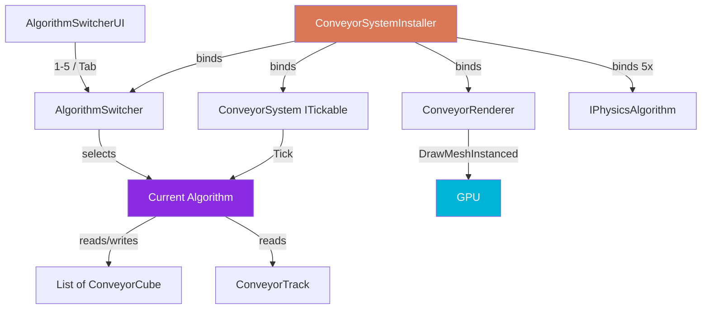

<div align="center">

# 🔁 LoopSort

### Conveyor Physics Algorithm Test Bench

*A side-by-side comparison lab for 5 different collision algorithms running on an oval conveyor belt — fully rendered via `Graphics.DrawMeshInstanced` with **zero GameObjects** in the scene.*

<br />

[](README.md)
[](README.tr.md)

<br />


<br />

```
    ╭─────────────────────────────╮
   │   ▣ ▣ ▣ ▣ ▣ ▣ ▣ ▣ ▣ ▣ ▣     │
   │                              │
    ╰─────────────────────────────╯
```

</div>

---

## ✨ About

**LoopSort** is an experimental playground that lets you test and compare **5 different physics/collision algorithms** on cubes moving around an oval conveyor belt inside Unity.

There are **no GameObjects** in the scene — every cube and the belt itself are drawn on the GPU via `Graphics.DrawMeshInstanced`. This approach lets hundreds of objects render simultaneously with virtually no per-object CPU overhead.

> 🤖 This entire project was built using **[Claude Code](https://claude.ai/code)** (Anthropic's CLI). From architectural design to algorithm implementations and Zenject bindings — the full stack is AI-assisted pair programming.

---

## 🚀 Features

| | |
|---|---|
| 🧠 **5 Physics Algorithms** | Switch between them at runtime with a single keypress |
| 🎨 **Zero GameObjects** | All rendering via `DrawMeshInstanced` |
| 💉 **Zenject DI** | No singletons, no statics, no `FindObjectOfType` |
| ⚡ **UniTask** | Modern async, coroutine-free |
| 🎯 **ITickable** | Physics loop uses Zenject's tick system — not `MonoBehaviour.Update()` |
| ⚙️ **ScriptableObject Config** | All parameters tunable from the Inspector |

---

## 🧪 Algorithms

| # | Algorithm | File | Complexity | Description |
|---|-----------|------|------------|-------------|
| 1 | 🟢 **Spatial Hash** | `SpatialHashPhysics.cs` | O(n) avg | 1D grid cells, only neighboring cells are tested |
| 2 | 🔵 **AABB** | `AABBPhysics.cs` | O(n²) | Axis-Aligned Bounding Box overlap check |
| 3 | 🟡 **SAT** | `SATPhysics.cs` | O(n²) | Separating Axis Theorem — accurate for rotated cubes |
| 4 | 🔴 **Circle Approx** | `CircleApproxPhysics.cs` | O(n²) | Approximates cubes as circles — the fastest algorithm |
| 5 | 🟣 **Verlet** | `VerletPhysics.cs` | O(n × iter) | Verlet integration + iterative constraint solver |

Every algorithm implements the `IPhysicsAlgorithm` interface and lives in its own file.

### Performance Profile

```
Algorithm          │ 50 cubes │ 200 cubes │ 500 cubes │ Accuracy
───────────────────┼──────────┼───────────┼───────────┼──────────
Spatial Hash       │   ████   │   █████   │   █████   │  ★★★★
AABB               │   ████   │   ██      │   █       │  ★★★★
SAT                │   ███    │   █       │   ·       │  ★★★★★
Circle Approx      │   █████  │   █████   │   ████    │  ★★★
Verlet (4 iter)    │   ████   │   ███     │   ██      │  ★★★★★
```

---

## 🎮 Controls

| Key | Action |
|-----|--------|
| `1` – `5` | Jump to the corresponding algorithm |
| `Tab` | Cycle to the next algorithm |
| UI Panel | Select via buttons in the top-left corner |

---

## 📦 Installation

### Requirements

- **Unity 6** (6000.0.67f1 or higher)
- **Zenject** (Extenject) — Dependency Injection
- **UniTask** — Async operations
- **Input System** — Keyboard input

### Steps

1. Clone this repository:
   ```bash
   git clone https://github.com/<your-username>/AlgorithmTest_V02.git
   ```

2. Open the project in Unity Hub (with Unity 6).

3. Ensure Zenject, UniTask and Input System packages are installed.
   They're already listed in `Packages/manifest.json`.

4. Open the scene under `Assets/Scenes`.

5. Hit **Play** — colored cubes will start spinning around the oval belt.

6. Use `1`–`5` to switch algorithms and observe the behavioral differences.

### Inspector Settings

Select the **ConveyorConfig** ScriptableObject assigned to the `ConveyorSystemInstaller` object in the scene. You can tune these from the Inspector:

| Parameter | Default | Description |
|-----------|---------|-------------|
| Oval Width | 6 | Belt width (X axis) |
| Oval Height | 4 | Belt height (Z axis) |
| Waypoint Count | 64 | Number of points on the oval path |
| Belt Width | 1.2 | Visual belt width |
| Cube Count | 1 | Cube count |
| Cube Size | (0.35, 0.35, 0.35) | Size per cube |
| Conveyor Speed | 3 | Belt speed |
| Friction Coefficient | 6 | Friction coefficient |
| Verlet Iterations | 4 | Verlet algorithm iteration count |
| Hash Cell Size | 0.5 | Spatial Hash cell size |
| Draw Gizmos | true | Toggle debug drawing |

---

## 🏗️ Architecture



---

## 📁 Project Structure

```
Assets/Scripts/LoopSortTest/
├── Algorithms/
│   ├── AABBPhysics.cs              ← AABB overlap algorithm
│   ├── SpatialHashPhysics.cs       ← Spatial hashing grid
│   ├── SATPhysics.cs               ← Separating Axis Theorem
│   ├── CircleApproxPhysics.cs      ← Circle approximation
│   └── VerletPhysics.cs            ← Verlet integration
│
├── Config/
│   ├── ConveyorConfig.cs           ← ScriptableObject — all parameters
│   └── TrackFactory.cs             ← Oval track builder
│
├── Core/
│   ├── Interfaces/
│   │   ├── IPhysicsAlgorithm.cs    ← Algorithm contract
│   │   └── IAlgorithmSwitcher.cs   ← Switcher contract
│   ├── Models/
│   │   ├── ConveyorCube.cs         ← Cube data model
│   │   └── ConveyorTrack.cs        ← Oval path data + t→position conversion
│   └── Services/
│       ├── ConveyorSystem.cs       ← Main orchestrator (ITickable)
│       ├── ConveyorRenderer.cs     ← DrawMeshInstanced wrapper
│       └── AlgorithmSwitcher.cs    ← Runtime algorithm switcher
│
├── Installers/
│   └── ConveyorSystemInstaller.cs  ← Zenject bindings
│
└── UI/
    ├── AlgorithmSwitcherUI.cs      ← IMGUI panel + keyboard shortcuts
    └── ConveyorGizmoDrawer.cs      ← Debug visualization
```

---

## 🧱 Architectural Principles

| Rule | Description |
|------|-------------|
| **Zenject DI** | All dependencies via constructor/field injection. `static`, `singleton`, `FindObjectOfType` forbidden. |
| **UniTask** | For async operations. No coroutines. |
| **ITickable** | Physics tick uses Zenject's `ITickable`. `MonoBehaviour.Update()` only for render. |
| **Interface-driven** | Every algorithm implements `IPhysicsAlgorithm`. To add a new one: implement the interface + add a binding in the Installer. |
| **One file, one responsibility** | Every algorithm in its own file. |

---

## ➕ Adding a New Algorithm

1. Create a new `.cs` file under `Algorithms/`.
2. Implement the `IPhysicsAlgorithm` interface:
   ```csharp
   public class MyPhysics : IPhysicsAlgorithm
   {
       public string AlgorithmName => "My Algorithm";

       public void Tick(List<ConveyorCube> cubes, ConveyorTrack track,
                        ConveyorConfig config, float dt)
       {
           // Physics logic
       }

       public void Dispose() { }
   }
   ```
3. Add a binding in `ConveyorSystemInstaller.cs`:
   ```csharp
   Container.Bind<IPhysicsAlgorithm>().To<MyPhysics>().AsSingle();
   ```
4. It'll automatically appear in the UI panel and keyboard shortcuts.

---

## 📄 What is `CLAUDE.md`?

The `CLAUDE.md` file at the project root is a rulebook and architectural guide that **Claude Code** (Anthropic's CLI tool) follows while working on the project.

When Claude Code starts a conversation, it automatically reads `CLAUDE.md` from the working directory and follows its instructions. This file serves to:

- 📐 **Architectural ruleset** — which patterns to use, which are forbidden (e.g. "no coroutines, use UniTask")
- 📂 **File structure** — where new files should go
- 🔌 **Interface definitions** — which interfaces algorithms must implement
- 💻 **Code examples** — how each algorithm should be written
- 📋 **Implementation order** — what sequence tasks should follow

In short, `CLAUDE.md` is a configuration that guides the AI as if it were the project's "tech lead." It helps Claude Code produce code consistent with the project's architecture and conventions.

> **Note:** `CLAUDE.md` is Claude-Code-specific. It's not required for the project to run — it only guides the AI assistant during development.

---

## 📜 License

This project is built for educational and experimental purposes. Use and modify freely.

---

<div align="center">

*Built with ❤️ and [Claude Code](https://claude.ai/code)*

[](README.md)
[](README.tr.md)

</div>
