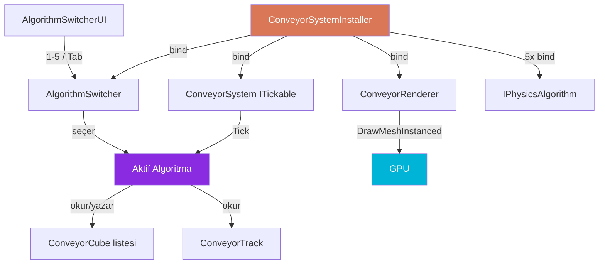

<div align="center">

# 🔁 LoopSort

### Konveyör Fizik Algoritma Test Tezgâhı

*Oval bir conveyor belt üzerinde çalışan 5 farklı çarpışma algoritmasını karşılaştırmalı olarak test etmek için bir deneme ortamı — sahnede **hiçbir GameObject** olmadan, tamamen `Graphics.DrawMeshInstanced` ile render edilir.*

<br />

[](README.md)
[](README.tr.md)

<br />


<br />

```
    ╭─────────────────────────────╮
   │   ▣ ▣ ▣ ▣ ▣ ▣ ▣ ▣ ▣ ▣ ▣     │
   │                              │
    ╰─────────────────────────────╯
```

</div>

---

## ✨ Proje Nedir?

**LoopSort**, Unity içinde oval bir conveyor belt üzerinde hareket eden küpler için **5 farklı fizik/çarpışma algoritmasını** karşılaştırmalı olarak test etmenizi sağlayan bir deneme ortamıdır.

Sahnede **hiçbir GameObject oluşturulmaz** — tüm küpler ve bant görseli `Graphics.DrawMeshInstanced` ile GPU-tarafında render edilir. Bu yaklaşım, yüzlerce nesnenin performans kaybına yol açmadan aynı anda çizilmesini sağlar.

> 🤖 Bu proje tamamen **[Claude Code](https://claude.ai/code)** (Anthropic CLI) kullanılarak geliştirilmiştir. Mimari tasarımdan kod yazımına, algoritma implementasyonlarından Zenject binding'lerine kadar tüm süreç yapay zeka destekli pair-programming ile tamamlanmıştır.

---

## 🚀 Özellikler

| | |
|---|---|
| 🧠 **5 Fizik Algoritması** | Runtime'da tek tuşa basarak geçiş yapın |
| 🎨 **Sıfır GameObject** | Tüm render `DrawMeshInstanced` ile |
| 💉 **Zenject DI** | Hiçbir singleton, static veya `FindObjectOfType` yok |
| ⚡ **UniTask** | Coroutine yerine modern async pattern |
| 🎯 **ITickable** | Fizik döngüsü MonoBehaviour `Update()` yerine Zenject tick sistemiyle |
| ⚙️ **ScriptableObject Config** | Tüm parametreler Inspector'dan ayarlanabilir |

---

## 🧪 Algoritmalar

| # | Algoritma | Dosya | Karmaşıklık | Açıklama |
|---|-----------|-------|-------------|----------|
| 1 | 🟢 **Spatial Hash** | `SpatialHashPhysics.cs` | O(n) avg | 1D grid hücrelerine bölme, yalnızca komşu hücreler test edilir |
| 2 | 🔵 **AABB** | `AABBPhysics.cs` | O(n²) | Axis-Aligned Bounding Box overlap kontrolü |
| 3 | 🟡 **SAT** | `SATPhysics.cs` | O(n²) | Separating Axis Theorem — dönmüş küpler için doğru sonuç |
| 4 | 🔴 **Circle Approx** | `CircleApproxPhysics.cs` | O(n²) | Küpleri daire ile yaklaşık temsil, en hızlı algoritma |
| 5 | 🟣 **Verlet** | `VerletPhysics.cs` | O(n × iter) | Verlet integration + iteratif constraint çözücü |

Her algoritma `IPhysicsAlgorithm` arayüzünü implemente eder ve tamamen bağımsız bir dosyada bulunur.

### Performans Profili

```
Algoritma          │ 50 küp   │ 200 küp   │ 500 küp   │ Doğruluk
───────────────────┼──────────┼───────────┼───────────┼──────────
Spatial Hash       │   ████   │   █████   │   █████   │  ★★★★
AABB               │   ████   │   ██      │   █       │  ★★★★
SAT                │   ███    │   █       │   ·       │  ★★★★★
Circle Approx      │   █████  │   █████   │   ████    │  ★★★
Verlet (4 iter)    │   ████   │   ███     │   ██      │  ★★★★★
```

---

## 🎮 Kontroller

| Tuş | İşlem |
|-----|-------|
| `1` – `5` | İlgili algoritmaya geç |
| `Tab` | Sıradaki algoritmaya geç |
| UI Panel | Sol üst köşedeki butonlarla seçim |

---

## 📦 Kurulum

### Gereksinimler

- **Unity 6** (6000.0.67f1 veya üstü)
- **Zenject** (Extenject) — Dependency Injection
- **UniTask** — Async işlemler
- **Input System** — Klavye kontrolü

### Adımlar

1. Bu repo'yu klonlayın:
   ```bash
   git clone https://github.com/<kullanici-adi>/AlgorithmTest_V02.git
   ```

2. Unity Hub'dan projeyi açın (Unity 6 ile).

3. Zenject, UniTask ve Input System paketlerinin yüklendiğinden emin olun.
   Proje `Packages/manifest.json` içerisinde bu bağımlılıkları zaten içermektedir.

4. `Assets/Scenes` altındaki sahneyi açın.

5. **Play** tuşuna basın — oval bant üzerinde renkli küpler dönmeye başlayacaktır.

6. `1`-`5` tuşlarıyla algoritmalar arasında geçiş yapın ve davranış farklarını gözlemleyin.

### Inspector Ayarları

Sahnedeki `ConveyorSystemInstaller` objesine atanmış olan **ConveyorConfig** ScriptableObject'i seçin. Inspector'dan şu parametreleri ayarlayabilirsiniz:

| Parametre | Varsayılan | Açıklama |
|-----------|-----------|----------|
| Oval Width | 6 | Bant genişliği (X ekseni) |
| Oval Height | 4 | Bant yüksekliği (Z ekseni) |
| Waypoint Count | 64 | Oval yol üzerindeki nokta sayısı |
| Belt Width | 1.2 | Bant görsel genişliği |
| Cube Count | 1 | Küp sayısı |
| Cube Size | (0.35, 0.35, 0.35) | Her küpün boyutu |
| Conveyor Speed | 3 | Bant hızı |
| Friction Coefficient | 6 | Sürtünme katsayısı |
| Verlet Iterations | 4 | Verlet algoritması iterasyon sayısı |
| Hash Cell Size | 0.5 | Spatial Hash hücre boyutu |
| Draw Gizmos | true | Debug çizimlerini aç/kapa |

---

## 🏗️ Mimari



---

## 📁 Proje Yapısı

```
Assets/Scripts/LoopSortTest/
├── Algorithms/
│   ├── AABBPhysics.cs              ← AABB overlap algoritması
│   ├── SpatialHashPhysics.cs       ← Spatial hashing grid
│   ├── SATPhysics.cs               ← Separating Axis Theorem
│   ├── CircleApproxPhysics.cs      ← Daire yaklaşımı
│   └── VerletPhysics.cs            ← Verlet integration
│
├── Config/
│   ├── ConveyorConfig.cs           ← ScriptableObject — tüm parametreler
│   └── TrackFactory.cs             ← Oval track oluşturucu
│
├── Core/
│   ├── Interfaces/
│   │   ├── IPhysicsAlgorithm.cs    ← Algoritma sözleşmesi
│   │   └── IAlgorithmSwitcher.cs   ← Switcher sözleşmesi
│   ├── Models/
│   │   ├── ConveyorCube.cs         ← Küp veri modeli
│   │   └── ConveyorTrack.cs        ← Oval yol verisi + t→pozisyon dönüşümü
│   └── Services/
│       ├── ConveyorSystem.cs       ← Ana orkestrator (ITickable)
│       ├── ConveyorRenderer.cs     ← DrawMeshInstanced wrapper
│       └── AlgorithmSwitcher.cs    ← Runtime algoritma değiştirici
│
├── Installers/
│   └── ConveyorSystemInstaller.cs  ← Zenject binding'leri
│
└── UI/
    ├── AlgorithmSwitcherUI.cs      ← IMGUI panel + klavye kısayolları
    └── ConveyorGizmoDrawer.cs      ← Debug görselleştirme
```

---

## 🧱 Mimari Prensipler

| Kural | Açıklama |
|-------|----------|
| **Zenject DI** | Tüm bağımlılıklar constructor/field injection ile. `static`, `singleton`, `FindObjectOfType` yasak. |
| **UniTask** | Asenkron işlemler için. Coroutine kullanılmaz. |
| **ITickable** | Fizik tick'i Zenject'in `ITickable` arayüzü üzerinden. `MonoBehaviour.Update()` yalnızca render çağrısı için. |
| **Interface-driven** | Her algoritma `IPhysicsAlgorithm` implemente eder. Yeni algoritma eklemek için arayüzü implemente edin ve Installer'a bağlama ekleyin. |
| **Tek dosya, tek sorumluluk** | Her algoritma kendi dosyasında. |

---

## ➕ Yeni Algoritma Eklemek

1. `Algorithms/` klasöründe yeni bir `.cs` dosyası oluşturun.
2. `IPhysicsAlgorithm` arayüzünü implemente edin:
   ```csharp
   public class MyPhysics : IPhysicsAlgorithm
   {
       public string AlgorithmName => "My Algorithm";

       public void Tick(List<ConveyorCube> cubes, ConveyorTrack track,
                        ConveyorConfig config, float dt)
       {
           // Fizik mantığı
       }

       public void Dispose() { }
   }
   ```
3. `ConveyorSystemInstaller.cs` içerisine binding ekleyin:
   ```csharp
   Container.Bind<IPhysicsAlgorithm>().To<MyPhysics>().AsSingle();
   ```
4. Otomatik olarak UI panelinde ve klavye kısayollarında görünür.

---

## 📄 CLAUDE.md Nedir?

Projenin kök dizinindeki `CLAUDE.md` dosyası, **Claude Code**'un (Anthropic'in CLI aracı) proje üzerinde çalışırken uyacağı kurallar ve mimari rehberdir.

Claude Code bir konuşmaya başladığında, çalışma dizinindeki `CLAUDE.md` dosyasını otomatik olarak okur ve içindeki talimatlara göre hareket eder. Bu dosya şu amaçlara hizmet eder:

- 📐 **Mimari kural seti** — Hangi pattern'lerin kullanılacağı, hangilerinin yasak olduğu (örneğin: "Coroutine yasak, UniTask kullan")
- 📂 **Dosya yapısı** — Yeni dosyaların nereye oluşturulacağı
- 🔌 **Arayüz tanımları** — Algoritmaların hangi interface'i implemente etmesi gerektiği
- 💻 **Kod örnekleri** — Her algoritmanın nasıl yazılması gerektiği
- 📋 **Uygulama sırası** — İşlemlerin hangi sırada yapılacağı

Kısacası `CLAUDE.md`, yapay zekayı projenin "teknik lideri" gibi yönlendiren bir konfigürasyondur. Sayesinde Claude Code, projenin mimarisine uygun, tutarlı ve standart kod üretir.

> **Not:** `CLAUDE.md` Claude Code'a özeldir. Projenin çalışması için gerekli değildir — yalnızca geliştirme sürecinde AI asistanına rehberlik eder.

---

## 📜 Lisans

Bu proje eğitim ve deney amacıyla oluşturulmuştur. Serbestçe kullanabilir ve değiştirebilirsiniz.

---

<div align="center">

*❤️ ve [Claude Code](https://claude.ai/code) ile geliştirildi*

[](README.md)
[](README.tr.md)

</div>
